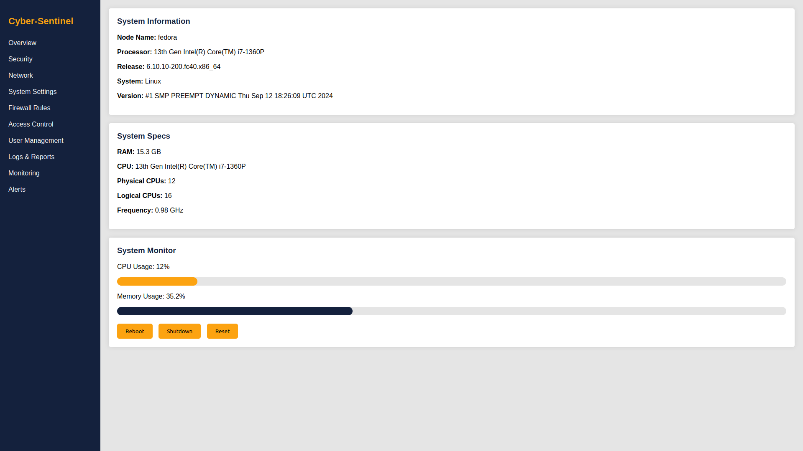

# Centralized Application-Context Aware Firewall


## Overview

The Centralized Application-Context Aware Firewall is a security solution designed to manage and monitor application-level network access across multiple endpoints. This project provides a centralized web console to control firewall policies for each application, identify suspicious traffic, and detect anomalies using AI/ML models.

### Key Features

- **Granular Access Control**: Restrict domains, IP addresses, and protocols for each application.
- **Centralized Management Console**: Deploy and manage firewall policies across endpoints.
- **Real-time Anomaly Detection**: Detect abnormal network traffic using AI/ML models (Isolation Forest and HGBClassifier).
- **Low Latency Communication**: Efficient communication between the central server and endpoint agents using gRPC.
- **Scalable Log Management**: ElasticSearch integration for high-performance log storage and querying.
- **Cross-Platform Compatibility**: Supports both Windows and Linux endpoints with platform-specific configurations.

---

## Project Structure

```plaintext
centralized-firewall/
├── docs/
├── backend/
├── agent/
├── config/
└── deployment/
```

- **docs/**: Project documentation, including diagrams and flowcharts.
- **backend/**: The central web console with API and services (written in Go and FastAPI).
- **agent/**: Endpoint firewall agent for Windows and Linux (written in Go).
- **config/**: Configuration files for settings and logging.
- **deployment/**: Docker and Kubernetes files for deployment and scaling.

---

## Components

### 1. Central Web Console
- **Technologies**: Golang, HTMX, Templ, Tailwind CSS, FastAPI
- **Features**: 
  - **Policy Management**: Define and update firewall rules for applications.
  - **Dashboard**: Real-time monitoring of alerts and logs using Grafana.
  - **Authentication**: JWT-based RBAC for secure access.

### 2. Endpoint Agent
- **Technologies**: Golang, gRPC, Windows Filtering Platform (WFP), Netfilter (Linux)
- **Features**:
  - **Context-Aware Firewall**: Enforces rules for each application.
  - **Anomaly Detection**: Analyzes network traffic in real time.
  - **Process Monitoring**: Monitors application behavior on Windows (ETW/WMI) and Linux (eBPF/procfs).

### 3. AI/ML Anomaly Detection
- **Models**: Isolation Forest, Histogram-based Gradient Boosting Classifier (HGBClassifier)
- **Purpose**: Detect abnormal network behavior based on application patterns.
- **Implementation**: Python-based models within FastAPI for high-performance inference.

### 4. Log Management
- **Technologies**: ElasticSearch, Prometheus, PostgreSQL
- **Functionality**:
  - **ElasticSearch**: High-performance log storage and querying.
  - **Prometheus**: Collects performance metrics.
  - **PostgreSQL**: Stores structured logs and policies.

---

## Installation & Setup

### Prerequisites

- **Docker** and **Docker Compose**
- **Golang** (v1.16+)
- **Python** (v3.8+ for AI/ML models)
- **ElasticSearch**, **Prometheus**, **Grafana**

### Steps

1. **Clone the Repository**

   ```bash
   git clone git@github.com:ThePygmalion/Cyber-Sentinel.git
   cd Cyber-Sentinel
   ```

2. **Configuration**
   - Edit `config/config.yaml` and `config/log_config.yaml` as needed.

3. **Build and Deploy (Docker)**

   ```bash
   docker-compose up -d
   ```

4. **Access the Web Console**
   - Open `http://localhost:8080` to access the central console.

### Kubernetes Deployment

For production-scale deployment:

```bash
kubectl apply -f deployment/kubernetes/
```

---

## Usage

### Central Web Console

1. **Dashboard**: Real-time monitoring of network traffic, anomalies, and alerts.
2. **Policy Management**: Define and update firewall rules per application.
3. **Log Analysis**: Analyze logs and historical data in Grafana.



### Endpoint Agent

- Install the agent on each endpoint to enforce policies and monitor traffic.
- Agents communicate with the console via gRPC, sending logs and receiving policy updates.

---

## AI/ML Anomaly Detection

- **Isolation Forest** and **HGBClassifier** models analyze network patterns and flag anomalies.
- Models run as FastAPI services for high-performance inference.

---

## Challenges & Solutions

### 1. **Separate Policies for Each Application**
   - **Solution**: Use WFP (Windows) and Netfilter (Linux) for process-specific network filtering.

### 2. **Efficient Communication**
   - **Solution**: gRPC enables low-latency, bi-directional communication between endpoints and the server.

### 3. **Cross-Platform Compatibility**
   - **Solution**: Uses Cgo for platform-specific functionality (e.g., ETW/WMI for Windows, eBPF/procfs for Linux).

---

## Contact

**Project Maintainers**
- GitHub: [ThePygmalion](https://github.com/ThePygmalion)